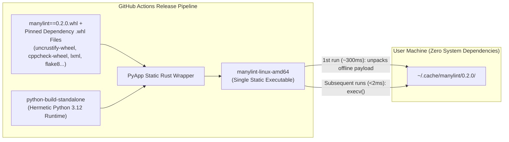

# The Hybrid Architecture: `manylint` as a Pinned PyPI Package + Static Binary Wrapper + `pre-commit` Hook

By combining **PyPI binary wheels**, a **strictly version-pinned `manylint` Python package**, and a **self-contained static binary wrapper**, we can get 100% cross-platform hermeticity without writing a custom multi-language Bazel build from scratch—while supporting `manylint` CLI users, `pip`/`uvx` users, and `pre-commit` users from the exact same codebase.

---

## 1. What PyPI Packages Do We Actually Need to Create?

If we audit all the linters in `ament_lint`, almost all of them **already** publish prebuilt platform wheels (`manylinux`, `macosx`, `win_amd64`) or pure-Python wheels on PyPI.

### A. Already on PyPI (Zero Packaging Work Needed)

| Linter / Component | Existing PyPI Package(s) | Wheel Type on PyPI |
| :--- | :--- | :--- |
| **`xmllint` (`libxml2`)** | **`lxml`** | Prebuilt binary wheels (`manylinux`, `macosx`, `win_amd64`) with `libxml2` & `libxslt` statically compiled inside |
| **`clang_format`** | **`clang-format`** | Prebuilt binary wheels (`manylinux`, `macosx`, `win_amd64`) published via `scikit-build` |
| **`clang_tidy`** | **`clang-tidy`** | Prebuilt binary wheels (`manylinux`, `macosx`, `win_amd64`) |
| **`flake8` + 7 Plugins** | `flake8`, `pycodestyle`, `pyflakes`, `mccabe`, `flake8-blind-except`, `flake8-builtins`, `flake8-class-newline`, `flake8-comprehensions`, `flake8-deprecated`, `flake8-import-order`, `flake8-quotes` | Pure-Python (`py3-none-any.whl`) |
| **`pep257`** | `pydocstyle`, `snowballstemmer` | Pure-Python (`py3-none-any.whl`) |
| **`mypy`** | `mypy` | Prebuilt `mypyc` binary wheels (`manylinux`, `macosx`, `win_amd64`) |
| **`ruff`** *(optional Python fixer)* | `ruff` | Prebuilt Rust binary wheels (`manylinux`, `macosx`, `win_amd64`) |

### B. Only 3 New PyPI Packages Needed

To make the entire ROS 2 linter suite installable from PyPI with zero system dependencies, we only need to create **two binary wheel packages** and **the `manylint` package itself**:

1. **`uncrustify-wheel` (Binary Wheel via `scikit-build-core` + `cibuildwheel`)**:
   * Compiles `uncrustify` (pinned to e.g. `0.78.1`) from C++17 source in GitHub Actions and places the static `uncrustify` binary into `<wheel>/bin/uncrustify` (and exposes `uncrustify_wheel.get_executable()`).
   * Built once per uncrustify release for `manylinux_2_17_x86_64`, `manylinux_2_17_aarch64`, `macosx_11_0_arm64`, `macosx_10_9_x86_64`, and `win_amd64`.
2. **`cppcheck-wheel` (Binary Wheel via `scikit-build-core` + `cibuildwheel`)**:
   * Compiles `cppcheck` (pinned to e.g. `2.14.0` with its bundled `simplecpp`, `tinyxml2`, and `picojson`) into `<wheel>/bin/cppcheck` for the same 5 OS/arch targets.
3. **`manylint` (Pure-Python Package `manylint-X.Y.Z-py3-none-any.whl`)**:
   * Contains the `manylint` CLI (`manylint check`, `manylint fix`, `manylint list`, `<export><manylint>` parser, `--output=junit` reporter).
   * Vendors/includes the pure-Python `ament_lint` modules (`cpplint.py`, `cmakelint.py`, `ament_copyright`, and the runners) plus ROS 2's canonical config files (`ament_code_style_0_78.cfg`, `ament_flake8.ini`, `.clang-format`, and `package_format2/3.xsd`).
   * Uses `lxml.etree.XMLSchema` (from the `lxml` wheel) + the bundled `package_format2/3.xsd` files to run `xmllint` validation and formatting in-process without needing `/usr/bin/xmllint` or internet access.

---

## 2. Exact Version Pinning (`==`) for Identical Cross-Platform Behavior

To guarantee that `manylint==0.2.0` produces the **exact same lint results on Ubuntu 22.04, Ubuntu 24.04, macOS, and Windows**, `manylint`'s `pyproject.toml` pins every underlying linter and plugin with strict equality (`==`):

```toml
[project]
name = "manylint"
version = "0.2.0"
requires-python = ">=3.10"
dependencies = [
  # Prebuilt native C/C++/Rust binary wheels:
  "uncrustify-wheel == 0.78.1",
  "cppcheck-wheel == 2.14.0",
  "clang-format == 18.1.8",
  "lxml == 5.3.0",
  "ruff == 0.6.8",

  # Exact pinned Python linters & Flake8 plugins:
  "flake8 == 7.1.1",
  "pycodestyle == 2.12.1",
  "pyflakes == 3.2.0",
  "mccabe == 0.7.0",
  "flake8-blind-except == 0.2.1",
  "flake8-builtins == 2.5.0",
  "flake8-class-newline == 1.6.0",
  "flake8-comprehensions == 3.15.0",
  "flake8-deprecated == 2.2.1",
  "flake8-import-order == 0.18.2",
  "flake8-quotes == 3.4.0",
  "pydocstyle == 6.3.0",
  "snowballstemmer == 2.2.0",
]

[project.scripts]
manylint = "manylint.cli:main"
```

Because every dependency resolves to a deterministic wheel containing the exact same C++ binaries (`uncrustify 0.78.1`, `cppcheck 2.14.0`, `libxml2` inside `lxml 5.3.0`) and Python bytecode, OS package differences (`apt` / `brew`) are completely bypassed.

---

## 3. Dual Distribution: PyPI Library + Standalone Static Binary Wrapper

How can we offer **both** a standard PyPI package (`pip install manylint`) **and** a single zero-dependency static binary (`manylint-linux-amd64`, `manylint-linux-arm64`, `manylint-osx-arm64`, `manylint-osx-amd64`, `manylint-windows-amd64.exe`) without maintaining two different codebases?

### How the Static Wrapper Binary Works (`PyApp` / `PyOxidizer` / `scie`)

Tools like **[`PyApp`](https://ofek.dev/pyapp/)** (a static Rust binary wrapper used by official Python packaging tools like `Hatch`) or **`scie-pants` (`ptex`)** are designed specifically for this pattern:



1. **At Build Time (in GitHub Actions)**:
   * We run `pip download --only-binary=:all: manylint==0.2.0 -d dist/wheels/` for the target platform (`linux_x86_64`, `linux_aarch64`, `macosx_11_0_arm64`, `win_amd64`).
   * We compile **[`PyApp`](https://ofek.dev/pyapp/)** (`cargo build --release`) with:
     * `PYAPP_PROJECT_NAME=manylint`
     * `PYAPP_PROJECT_VERSION=0.2.0`
     * `PYAPP_DISTRIBUTION_EMBED=true` (embeds the `indygreg/python-build-standalone` Python 3.12 runtime directly into the Rust binary)
     * `PYAPP_PROJECT_EMBED_WHEELS=true` (embeds `manylint` and all its pinned `.whl` files—including `uncrustify-wheel`, `cppcheck-wheel`, `lxml`, and `flake8`—directly into the Rust binary)
2. **At Runtime (on the User's Machine)**:
   * The user downloads `manylint-linux-amd64` via `curl ... | bash` onto a bare container or laptop (even one with **no Python, no `pip`, and no `apt` packages installed**).
   * **First run**: `manylint-linux-amd64` extracts its embedded Python runtime and embedded `.whl` files into `~/.cache/manylint/0.2.0/` (100% offline, no internet access required) and executes `manylint`.
   * **Every subsequent run**: The Rust binary checks that `~/.cache/manylint/0.2.0/` exists and immediately `execv`s `~/.cache/manylint/0.2.0/bin/manylint` in `< 2ms`.

---

## 4. One Codebase, Three Ways to Install and Use `manylint`

With this hybrid architecture, **100% of `manylint` is maintained in a single Python repository**, yet every type of user gets their preferred workflow:

### Workflow 1: Zero-Dependency Static Binary (`curl ... | bash`)
For developers, Docker containers, or CI machines that just want a single static executable on `PATH` with zero setup:
```bash
curl -fsSL https://github.com/sloretz/manylint/releases/latest/download/install.sh | bash
manylint check src/
manylint fix src/
```

### Workflow 2: Python Ecosystem (`pipx` / `uvx` / `pip`)
For developers who already use `uv`, `pipx`, or a Python virtual environment:
```bash
# Run ephemerally without installing globally:
uvx manylint check src/

# Or install into an isolated venv:
pipx install manylint
```

### Workflow 3: Native `pre-commit` / `prek` Hook
Because `manylint` is a valid Python package on PyPI (`language: python`), the `manylint` repository simply includes a `.pre-commit-hooks.yaml`:

```yaml
# .pre-commit-hooks.yaml
- id: manylint-fix
  name: manylint (fix)
  description: Run ROS 2 / Ament auto-formatters and linters
  entry: manylint fix
  language: python
  types: [file]
  require_serial: true

- id: manylint-check
  name: manylint (check)
  description: Check ROS 2 / Ament linters without modifying files
  entry: manylint check
  language: python
  types: [file]
  require_serial: true
```

Any repository that already uses `pre-commit` (or `prek`) can add a 5-line block to `.pre-commit-config.yaml`:
```yaml
repos:
  - repo: https://github.com/sloretz/manylint
    rev: v0.2.0
    hooks:
      - id: manylint-fix
```
When `pre-commit` runs, it automatically creates a virtualenv from the `manylint` PyPI package and its pinned binary wheels (`uncrustify-wheel`, `cppcheck-wheel`, `lxml`, `flake8`, etc.)—giving `pre-commit` users the exact same hermetic binaries, `package.xml` (`<export><manylint>`) awareness, and zero-system-dependency guarantee as the standalone static binary!
