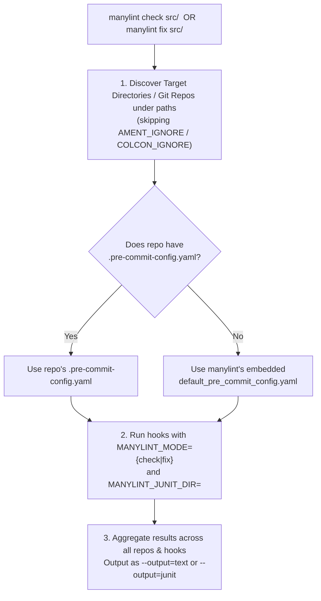

# The Hybrid Architecture: `manylint` as a Pinned `pre-commit` Distribution & Multi-Repo CLI

Instead of inventing a custom XML configuration schema (`<export><manylint>`) or building a custom C++ linter runner from scratch, `manylint` splits cleanly into two parts:
1. **`manylint` the Python Library & Hook Provider**: Pins exact `==` versions of all ROS 2 linters (`uncrustify-wheel`, `cppcheck-wheel`, `lxml`, `flake8` + 7 plugins, `pydocstyle`, `clang-format`) and provides built-in `pre-commit` hooks + a built-in default `.pre-commit-config.yaml`.
2. **`manylint` the CLI Tool**: Discovers repositories/packages under a path (e.g. `manylint check src/` or `manylint fix src/`), uses each repo's `.pre-commit-config.yaml` if one exists (or `manylint`'s built-in default `.pre-commit-config.yaml` if none exists), handles the `check` vs. `fix` distinction, and formats results across all repos as `--output=text` or `--output=junit`.

---

## 1. What Information `.pre-commit-config.yaml` Already Contains (Replacing `<export><manylint>`)

Everything we previously considered putting into `<export><manylint>` inside `package.xml` is **already first-class syntax in `.pre-commit-config.yaml`**:

| Customization Need | Previous `<export><manylint>` Idea | Native `.pre-commit-config.yaml` Syntax |
| :--- | :--- | :--- |
| **Choose which linters run** | `<uncrustify enabled="false"/>` | Omit `id: uncrustify` from `hooks:` (or add `id: clang-format`) |
| **Global file exclusions** | `<exclude>src/third_party/**</exclude>` | Top-level `exclude: ^src/third_party/` |
| **Per-linter file exclusions** | `<cppcheck><exclude>test/**</exclude></cppcheck>` | Hook-level `exclude: ^test/` or `files: ^src/` |
| **Custom linter config file** | `<uncrustify><config>my.cfg</config></uncrustify>` | Hook-level `args: ["-c", "my.cfg"]` |
| **Custom CLI arguments** | `<cppcheck><args>-I include</args></cppcheck>` | Hook-level `args: ["-I", "include"]` |

### Example `.pre-commit-config.yaml` for a Customized Repository
If a repository wants to customize which linters run or pass custom config files/arguments, it simply drops a standard `.pre-commit-config.yaml` in its root:

```yaml
# Optional .pre-commit-config.yaml (only needed if customizing defaults!)
exclude: ^(src/third_party/|include/generated/)

repos:
  - repo: https://github.com/sloretz/manylint
    rev: v0.2.0
    hooks:
      - id: copyright
        args: ["--add-missing", "Open Source Robotics Foundation, Inc.", "apache2"]
      - id: cppcheck
        exclude: ^test/benchmark_
        args: ["-I", "include", "--language=c++"]
      - id: cpplint
        args: ["--linelength=120"]
      - id: flake8
        args: ["--config=.flake8"]
      - id: lint_cmake
      - id: pep257
      - id: uncrustify
        args: ["-c", "custom_uncrustify.cfg"]
      - id: xmllint
      # Can also mix in any standard third-party pre-commit hooks!
  - repo: https://github.com/codespell-project/codespell
    rev: v2.3.0
    hooks:
      - id: codespell
```

### Why Replacing `<export><manylint>` with `.pre-commit-config.yaml` Is a Huge Win
1. **Zero Config Required by Default**: If a repository has **no** `.pre-commit-config.yaml`, `manylint` automatically uses its embedded default `.pre-commit-config.yaml` (running `copyright`, `cppcheck`, `cpplint`, `flake8`, `lint_cmake`, `pep257`, `uncrustify`, and `xmllint` with ROS 2's standard configs).
2. **No Custom XML Schema to Learn**: When customization *is* needed, developers write a standard `.pre-commit-config.yaml` with full IDE autocomplete, and can even include non-ROS hooks like `codespell` or `check-yaml`.
3. **Works with Both `manylint` and Standard `pre-commit`**: A repository with `.pre-commit-config.yaml` works with `manylint check`, `manylint fix`, `pre-commit run`, and `pre-commit.ci`.

---

## 2. How `manylint` Works Under the Hood

### Part A: `manylint` the Python Library (`pyproject.toml`)
The `manylint` package on PyPI pins the exact versions of `pre-commit` and all underlying linters so every platform (`linux-amd64`, `linux-arm64`, `osx-arm64`, `osx-amd64`, `windows-amd64`) runs the exact same binaries and Python bytecode:

* **2 New Binary Wheel Packages on PyPI** (built via `scikit-build-core` + `cibuildwheel`):
  1. `uncrustify-wheel == 0.78.1`
  2. `cppcheck-wheel == 2.14.0`
* **Existing Prebuilt Binary / Pure-Python Wheels on PyPI**:
  * `pre-commit == 4.0.1`
  * `lxml == 5.3.0` (powers `xmllint` XSD validation & `--format` in-process via statically linked `libxml2`)
  * `clang-format == 18.1.8`
  * `flake8 == 7.1.1` + the 7 `flake8-*` plugins (`blind-except`, `builtins`, `class-newline`, `comprehensions`, `deprecated`, `import-order`, `quotes`)
  * `pydocstyle == 6.3.0`
* **Bundled Assets Inside `manylint`**:
  * `manylint/default_pre_commit_config.yaml` (the built-in fallback `.pre-commit-config.yaml`)
  * `ament_code_style_0_78.cfg`, `ament_flake8.ini`, `.clang-format`, `package_format2.xsd`, `package_format3.xsd`, `cpplint.py`, `cmakelint.py`, and `ament_copyright`.

---

### Part B: `manylint` the Multi-Repo CLI Orchestrator

When a user runs `manylint check src/` or `manylint fix src/`:



#### 1. Multi-Repo & Multi-Package Discovery
* `manylint` walks the target path(s) (e.g., `src/`):
  * It identifies every Git repository (or standalone ROS package directory if outside Git), automatically pruning any directory containing `AMENT_IGNORE` or `COLCON_IGNORE`.
  * For each discovered target:
    * If `<target>/.pre-commit-config.yaml` exists, `manylint` runs `pre-commit` with `-c <target>/.pre-commit-config.yaml`.
    * If no `.pre-commit-config.yaml` exists, `manylint` runs `pre-commit` with `-c <manylint_pkg>/default_pre_commit_config.yaml`.

#### 2. How `manylint check` vs. `manylint fix` Works with `.pre-commit-config.yaml`
How does a single `.pre-commit-config.yaml` support both read-only checking (`manylint check`) and in-place fixing (`manylint fix`)?
1. **For `manylint`'s Built-In Hooks (`uncrustify`, `clang_format`, `xmllint`, `copyright`)**:
   * The `manylint` CLI sets the environment variable `MANYLINT_MODE=check` or `MANYLINT_MODE=fix` before invoking `pre-commit`.
   * When `MANYLINT_MODE=check`: `uncrustify`, `clang_format`, `xmllint`, and `copyright` run in **read-only diff/check mode** (printing unified diffs and writing `<hook>.xunit.xml` without modifying files).
   * When `MANYLINT_MODE=fix`: They run with `--reformat` / `--format` / `--add-missing`, modifying files in-place on disk!
2. **For Third-Party Hooks in a Custom `.pre-commit-config.yaml` (e.g., `codespell --write-changes` or `end-of-file-fixer`)**:
   * During `manylint fix`: Any files modified by third-party hooks are kept on disk.
   * During `manylint check`: If a third-party hook modifies files in the working tree, `manylint` captures the resulting `git diff`, records the diff as a violation in the text/JUnit report, and restores the original file contents so `manylint check` remains **strictly non-destructive**.

#### 3. How `--output=text` and `--output=junit` Work Across Multiple Repositories
* `manylint` passes `MANYLINT_JUNIT_DIR=<temp_dir>/<repo_or_pkg_name>` to each hook execution.
* Built-in hooks emit detailed per-file XUnit XML (`<testcase classname="<pkg>.<linter>" name="<file>">`), while any third-party `pre-commit` hooks have their `stdout`/`stderr` and exit code wrapped into a `<testsuite name="<repo>.<hook_id>">` automatically.
* Finally, `manylint` formats the combined results across all repositories as either:
  * **`--output=text`**: Clean terminal output grouped by repository/package and hook, with a summary table at the end.
  * **`--output=junit`**: Either a single aggregated `<testsuites name="manylint">` XML document (`--junit-file`) or a `colcon test-result`-compatible directory tree (`--junit-dir`).

---

## 3. Dual Installation: PyPI Library + Static Binary Wrapper

Because `manylint` is a pure-Python package whose dependencies are all prebuilt wheels (`uncrustify-wheel`, `cppcheck-wheel`, `lxml`, `flake8`, `pre-commit`), we can distribute it in **two ways from the same build pipeline**:

1. **On PyPI (`pip install manylint` / `uvx manylint`)**:
   * Installs the `manylint` Python library and CLI along with all `==`-pinned linter wheels.
   * Also allows `repo: https://github.com/sloretz/manylint` to be used directly in `.pre-commit-config.yaml`.
2. **As a Standalone Static Binary (`manylint-linux-amd64`, `manylint-linux-arm64`, `manylint-osx-arm64`, `manylint-windows-amd64.exe`)**:
   * Built in GitHub Actions using **[`PyApp`](https://ofek.dev/pyapp/)** (`PYAPP_DISTRIBUTION_EMBED=true`, `PYAPP_PROJECT_EMBED_WHEELS=true`), which embeds `python-build-standalone` + the `manylint` wheel + all pinned linter wheels directly inside a static Rust executable.
   * Installed via `curl -fsSL https://.../install.sh | bash` into `~/.local/bin/manylint`.
   * Even when using `manylint`'s built-in hooks in `.pre-commit-config.yaml`, `manylint` uses `language: system` (pointing to its own embedded virtualenv in `~/.cache/manylint/<version>/bin`), so **`pre-commit` never even needs to download or build a virtualenv over the network!**
