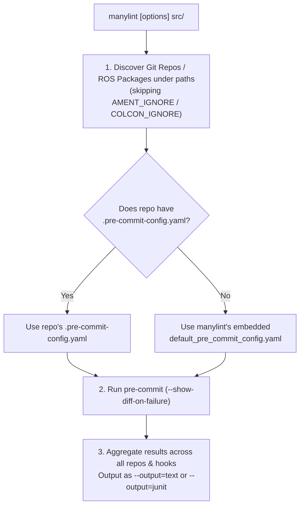

# The Hybrid Architecture: `manylint` as a Pinned `pre-commit` Distribution & Multi-Repo CLI

By embracing `pre-commit`'s native execution model (where check-only hooks report violations and formatter hooks modify files in-place while failing the pass if changes were needed), `manylint` becomes radically simpler.

There is **no `check` vs. `fix` verb distinction** and **no `MANYLINT_MODE` environment variable**:
1. **`manylint` the Python Library & Hook Provider**: Pins exact `==` versions of `pre-commit` and all ROS 2 linters (`uncrustify-wheel`, `cppcheck-wheel`, `lxml`, `flake8` + 7 plugins, `pydocstyle`, `clang-format`) and provides standard `pre-commit` hooks + a built-in fallback `default_pre_commit_config.yaml`.
2. **`manylint` the CLI Tool (`manylint [paths ...]`)**: Discovers Git repositories/packages under a path (e.g. `manylint src/`), uses each repo's `.pre-commit-config.yaml` if one exists (or `manylint`'s built-in default `.pre-commit-config.yaml` if none exists), runs `pre-commit`, and outputs results across all repositories as `--output=text` or `--output=junit`.

---

## 1. Why Eliminating `check` vs. `fix` Makes Everything Simpler

In `pre-commit` (and already in [`ament_uncrustify --reformat`](file:///workspaces/ros2/src/ament/ament_lint/ament_uncrustify/ament_uncrustify/main.py#L181-L219) and [`ament_clang_format --reformat`](file:///workspaces/ros2/src/ament/ament_lint/ament_clang_format/ament_clang_format/main.py#L216-L234)):
* When a formatter hook (`uncrustify --reformat`, `clang-format -i`, `xmllint --format`) runs on an unformatted file, it **reformats the file in-place AND exits `1`** (while `pre-commit --show-diff-on-failure` prints the unified diff).
* When a check-only hook (`cppcheck`, `cpplint`, `flake8`, `pep257`, `lint_cmake`, `copyright`) runs, it **reports errors and exits `1`** if violations exist.

This means **a single command (`manylint src/`) serves both local developers and CI**:
* **For a local developer**: Running `manylint src/` automatically reformats any C/C++ or XML style issues in-place and prints any remaining linter errors. Running `manylint src/` a second time exits `0` once everything is clean.
* **In CI**: Running `manylint --output=junit src/` fails with exit code `1` if any file needed auto-formatting or failed a check-only linter, capturing the exact unified diff in the JUnit XML report.
* **No special hook protocol**: Every `manylint` hook is just a 100% standard `pre-commit` hook (`ament_uncrustify --reformat`), and any third-party `pre-commit` hook (`codespell`, `end-of-file-fixer`, `ruff --fix`) works identically with zero special handling.

---

## 2. What PyPI Packages We Need to Create

Almost all linters in `ament_lint` **already** have prebuilt platform wheels (`manylinux`, `macosx`, `win_amd64`) or pure-Python wheels on PyPI:

| Linter / Component | Existing PyPI Package(s) | Wheel Type on PyPI |
| :--- | :--- | :--- |
| **`pre-commit`** | **`pre-commit`** | Pure-Python (`py3-none-any.whl`) |
| **`xmllint` (`libxml2`)** | **`lxml`** | Prebuilt binary wheels (`manylinux`, `macosx`, `win_amd64`) with `libxml2` & `libxslt` statically compiled inside |
| **`clang_format`** | **`clang-format`** | Prebuilt binary wheels (`manylinux`, `macosx`, `win_amd64`) |
| **`clang_tidy`** | **`clang-tidy`** | Prebuilt binary wheels (`manylinux`, `macosx`, `win_amd64`) |
| **`flake8` + 7 Plugins** | `flake8`, `pycodestyle`, `pyflakes`, `mccabe`, `flake8-blind-except`, `flake8-builtins`, `flake8-class-newline`, `flake8-comprehensions`, `flake8-deprecated`, `flake8-import-order`, `flake8-quotes` | Pure-Python (`py3-none-any.whl`) |
| **`pep257`** | `pydocstyle`, `snowballstemmer` | Pure-Python (`py3-none-any.whl`) |
| **`mypy`** | `mypy` | Prebuilt `mypyc` binary wheels |

We only need to publish **3 packages to PyPI**:
1. **`uncrustify-wheel`**: Prebuilt binary wheel (`cibuildwheel` + `scikit-build-core`) bundling `uncrustify 0.78.1` for `linux-amd64`, `linux-arm64`, `osx-arm64`, `osx-amd64`, and `windows-amd64`.
2. **`cppcheck-wheel`**: Prebuilt binary wheel (`cibuildwheel` + `scikit-build-core`) bundling `cppcheck 2.14.0` for the same 5 targets.
3. **`manylint`**: Pure-Python package on PyPI that pins exact `==` versions of `pre-commit`, `uncrustify-wheel`, `cppcheck-wheel`, `lxml`, `clang-format`, `flake8` (+ 7 plugins), and `pydocstyle`, while bundling `ament_lint`'s default configs (`ament_code_style_0_78.cfg`, `ament_flake8.ini`, `.clang-format`, `package_format2/3.xsd`) and `default_pre_commit_config.yaml`.

---

## 3. How `manylint [paths ...]` Works Under the Hood

1. **Multi-Repo Discovery & Fallback Config**:
   * `manylint` walks `[paths ...]` to find all Git repositories (or ROS package directories), ignoring subtrees with `AMENT_IGNORE` or `COLCON_IGNORE`.
   * If `<repo>/.pre-commit-config.yaml` exists, `manylint` runs `pre-commit` using that file.
   * If `<repo>/.pre-commit-config.yaml` does not exist, `manylint` runs `pre-commit -c <manylint>/default_pre_commit_config.yaml`.
2. **Text & JUnit Output Aggregation**:
   * Built-in hooks write per-file XUnit XML files when `MANYLINT_JUNIT_DIR` is set (using `ament_*`'s existing `--xunit-file` support!), and any third-party `pre-commit` hooks have their exit code and diff output wrapped into `<testcase>` entries automatically.
   * `manylint` outputs either human-readable text (`--output=text`, default) or JUnit XML (`--output=junit` via `--junit-file` or `--junit-dir`).

---

## 4. Dual Distribution: PyPI Package + Static Binary Wrapper

From the single `manylint` Python codebase, we ship two installation options:
1. **PyPI Package (`pip install manylint` / `uvx manylint`)**:
   * Standard Python package with `==`-pinned wheel dependencies, plus `.pre-commit-hooks.yaml` so custom `.pre-commit-config.yaml` files can reference `repo: https://github.com/sloretz/manylint`.
2. **Self-Contained Static Binary (`manylint-linux-amd64`, `manylint-linux-arm64`, `manylint-osx-arm64`, `manylint-osx-amd64`, `manylint-windows-amd64.exe`)**:
   * Built in GitHub Actions with **[`PyApp`](https://ofek.dev/pyapp/)** (`PYAPP_DISTRIBUTION_EMBED=true`, `PYAPP_PROJECT_EMBED_WHEELS=true`), embedding a standalone `python-build-standalone` interpreter + `manylint` + all pinned `.whl` files (`uncrustify-wheel`, `cppcheck-wheel`, `lxml`, `flake8`, `pre-commit`) inside a single executable.
   * Installed via `curl -fsSL https://.../install.sh | bash` into `~/.local/bin/manylint` with zero system dependencies.
